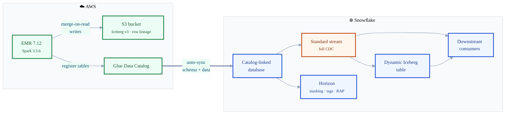

# The Battle for Compute: Iceberg V3 & Snowflake Interoperability

> Code companion for the [Medium article](https://medium.com/@your-handle/article-slug).  
> Tested: **March 25, 2026** | Snowflake V3 Support: **Public Preview**  
> EMR: **7.12** (Spark 3.5.6)

---

## Architecture



**Data flow:** EMR writes V3 Iceberg (with row lineage + deletion vectors) to S3 → Glue registers metadata → Snowflake CLD auto-syncs → Standard streams capture INSERT/UPDATE/DELETE → Dynamic Iceberg Tables or MERGE pipelines consume the changes — all governed by Horizon (masking, tagging, row access).

---

## Repo Structure

```
├── README.md
├── scripts/
│   ├── create_v3_table.py          # Create V3 table with row lineage in EMR
│   └── cdc_test_operations.py      # INSERT, UPDATE, DELETE, schema evolution
└── sql/
    ├── 01_setup.sql                # External Volume, Catalog Integration, CLD
    ├── 02_streams_and_cdc.sql      # Standard stream + CDC queries
    ├── 03_deletion_vectors.sql     # Inspect .puffin deletion vector files
    ├── 04_governance.sql           # Masking, tagging, row access policies
    ├── 05_dynamic_iceberg_table.sql# DIT from CLD source
    ├── 06_merge_pattern.sql        # Consume stream via MERGE INTO
    └── 07_cld_writeback.sql         # Write back to external catalog from Snowflake
```

---

## Prerequisites

### AWS
- S3 bucket (e.g., `s3://your-iceberg-data/`)
- AWS Glue catalog
- EMR Serverless application (**EMR 7.12+** required — Glue 5.0 does NOT write row lineage)
- IAM execution role with S3 + Glue permissions

### Snowflake
- External Volume → S3
- Catalog Integration (REST-based for Glue)
- Catalog-Linked Database (CLD)

> Partnerships like Snowflake and Microsoft OneLake further extend this pattern — Snowflake-managed Iceberg tables can be stored natively in OneLake, and OneLake data can be accessed from Snowflake via similar catalog integration patterns. This repo focuses on the AWS Glue path, but the Iceberg V3 concepts (row lineage, deletion vectors, CDC) apply across cloud boundaries.

---

## Quick Start

### 1. Set up Snowflake infrastructure
```bash
# Run in Snowflake worksheet or SnowSQL
# Edit placeholders: <ACCOUNT_ID>, <REGION>, your_glue_database
```
→ [`sql/01_setup.sql`](sql/01_setup.sql)

### 2. Create a V3 table in EMR
```bash
aws s3 cp scripts/create_v3_table.py s3://your-iceberg-data/scripts/

aws emr-serverless start-job-run \
    --application-id <EMR_APP_ID> \
    --execution-role-arn arn:aws:iam::<ACCOUNT_ID>:role/EMR-Execution-Role \
    --job-driver '{
        "sparkSubmit": {
            "entryPoint": "s3://your-iceberg-data/scripts/create_v3_table.py",
            "sparkSubmitParameters": "--conf spark.jars.packages=org.apache.iceberg:iceberg-spark-runtime-3.5_2.12:1.7.1,software.amazon.awssdk:bundle:2.29.38"
        }
    }'
```
→ [`scripts/create_v3_table.py`](scripts/create_v3_table.py)

### 3. Verify row lineage
```bash
aws s3 cp s3://your-iceberg-data/glue_tables/.../metadata/00001-xxx.metadata.json - \
    | python3 -m json.tool | grep next-row-id
# Expected: "next-row-id": 3
```
> If `next-row-id` is null or missing, your engine does not support V3 row lineage.

### 4. Run DML operations (INSERT, UPDATE, DELETE)
→ [`scripts/cdc_test_operations.py`](scripts/cdc_test_operations.py)

### 5. Create a standard stream & query CDC
→ [`sql/02_streams_and_cdc.sql`](sql/02_streams_and_cdc.sql)

### Expected CDC output

| order_id | product_name | amount | METADATA$ACTION | METADATA$ISUPDATE | METADATA$ROW_ID |
|----------|-------------|--------|-----------------|-------------------|-----------------|
| 2 | Widget B | 250.00 | DELETE | true | 0000000000000001:1 |
| 2 | Widget B Pro | 299.99 | INSERT | true | 000000000000000F:15 |
| 5 | Widget E | 550.00 | INSERT | false | 0000000000000007:7 |
| 6 | Widget F | 650.00 | INSERT | false | 0000000000000008:8 |

- **INSERT** + `ISUPDATE = false` → new row  
- **DELETE + INSERT** + `ISUPDATE = true` → UPDATE (old deleted, new inserted)  
- **DELETE** + `ISUPDATE = false` → true delete  

### 6. Explore further
- [`sql/03_deletion_vectors.sql`](sql/03_deletion_vectors.sql) — inspect `.puffin` soft-delete files
- [`sql/04_governance.sql`](sql/04_governance.sql) — masking, tagging, row access on Iceberg
- [`sql/05_dynamic_iceberg_table.sql`](sql/05_dynamic_iceberg_table.sql) — automated pipeline
- [`sql/06_merge_pattern.sql`](sql/06_merge_pattern.sql) — consume CDC via MERGE
- [`sql/07_cld_writeback.sql`](sql/07_cld_writeback.sql) — write back to external catalog from Snowflake

---

## CLD Write-Back

CLD is **read and write by default**. You can create and populate tables in your external catalog directly from Snowflake:

```sql
USE DATABASE glue_iceberg_db;

CREATE ICEBERG TABLE "your_database"."orders_summary" (
    "region" VARCHAR,
    "total_orders" INT,
    "total_revenue" NUMBER(12,2)
)
ICEBERG_VERSION = 3;

INSERT INTO "your_database"."orders_summary"
SELECT "region", COUNT(*), SUM("amount")
FROM "your_database"."customer_orders_v3"
GROUP BY "region";
```

This writes Parquet to S3 and registers the table in Glue — EMR/Spark can immediately query it via `spark.sql("SELECT * FROM glue_catalog.your_database.orders_summary")`. True bidirectional interoperability.

**Verified (March 25, 2026):** Table created as V3 (`ICEBERG_VERSION = 3`), registered in Glue (`catalog_table_name = orders_summary`), 4 Parquet files on S3, `can_write_metadata = Y`.

→ [`sql/07_cld_writeback.sql`](sql/07_cld_writeback.sql)

---

## Deletion Vectors

V3 with `merge-on-read` uses `.puffin` deletion vector files instead of rewriting data files:

| File | Type | Size |
|------|------|------|
| `00000-4-...-00001.parquet` | DATA_FILE | ~1.8KB |
| `00000-4-...-00001-deletes.puffin` | DELETION_VECTOR | ~2.2KB |

Without deletion vectors, a single UPDATE on a 1GB Parquet file rewrites the entire file. With them: a ~2KB marker file. At billions of rows, this is the difference between minutes and hours of CDC lag.

→ [`sql/03_deletion_vectors.sql`](sql/03_deletion_vectors.sql)

---

## Governance (Horizon)

All Snowflake governance features work on Iceberg tables via CLD — verified:

| Feature | Works on CLD Iceberg? | Survives Schema Evolution? |
|---------|----------------------|---------------------------|
| Masking Policies | Yes | Yes |
| Object Tags | Yes | Yes |
| Row Access Policies | Yes | Yes |
| Sensitive Data Classification | Yes | Yes |

→ [`sql/04_governance.sql`](sql/04_governance.sql)

---

## Test Results (March 25, 2026)

| Test | Result |
|------|--------|
| Standard stream on externally managed V3 (via CLD) | **PASS** — mode: DEFAULT |
| INSERT captured | **PASS** |
| UPDATE captured as DELETE + INSERT pair | **PASS** — `ISUPDATE = true`, same ROW_ID |
| DELETE captured | **PASS** |
| `METADATA$ROW_ID` present | **PASS** |
| Deletion vectors (`.puffin`) present | **PASS** |
| Masking policy on Iceberg table | **PASS** — ACTIVE |
| Object tagging (Horizon) | **PASS** |
| Row access policy | **PASS** |
| CLD schema sync (ADD/DROP/RENAME) | **PASS** |
| CLD write-back (CREATE TABLE + INSERT from Snowflake to Glue) | **PASS** — V3, Glue-registered, 4 Parquet files on S3 |
| Dynamic Iceberg Table from CLD source | **PASS** |

### Engine Row Lineage Support

| Engine | V3 Format | Row Lineage | Full CDC |
|--------|-----------|-------------|----------|
| AWS Glue 5.0 | Yes | **No** | No |
| EMR 7.12 (Spark 3.5.6) | Yes | **Yes** | **Yes** |
| Snowflake (managed) | Yes | **Yes** | **Yes** |

---

## Troubleshooting

### Glue 5.0 creates V3 but CDC still doesn't work

Glue 5.0 writes `format-version: 3` but does **not** write row lineage metadata (`next-row-id` is null). You must use **EMR 7.12+** (Spark 3.5.6) for row lineage. Check your metadata:

```bash
aws s3 cp s3://your-bucket/.../metadata/latest.metadata.json - | grep next-row-id
```

If it returns `null` or is missing — your engine doesn't support row lineage.

### Column names not found in Snowflake

Spark/Glue write lowercase column names. Snowflake preserves case for Iceberg tables. You must use double quotes:

```sql
-- Wrong
SELECT order_id FROM my_table;
-- ERROR: invalid identifier 'ORDER_ID'

-- Correct
SELECT "order_id" FROM my_table;
```

### Schema changes not syncing to CLD

CLD detects schema changes **only when a new snapshot arrives** (i.e., a data commit). Schema-only changes like `ALTER TABLE ADD COLUMN` without a subsequent INSERT/UPDATE won't trigger sync until the next DML operation creates a new snapshot.

### Stream shows mode INSERT_ONLY instead of DEFAULT

This means either:
- The table is V2, not V3
- The table is V3 but lacks row lineage (written by Glue, not EMR)
- V3 preview is not enabled on your account

Verify: `SHOW PARAMETERS LIKE 'ICEBERG_VERSION' IN TABLE <table_name>;`

### `Unable to parse the Iceberg metadata.json`

Your Snowflake account may not have V3 preview enabled, or the metadata was written by an engine that produces non-standard V3 metadata. Ensure:
1. EMR 7.12+ was used to create the table
2. The table has a valid `next-row-id` in metadata
3. Snowflake V3 Preview is active (it's PuPr — should be on for all accounts)

### Dynamic Iceberg Table fails with external catalog target

DIT output **must** be Snowflake-managed (`CATALOG = 'SNOWFLAKE'`). You cannot write a DIT to an externally managed target. The *source* can be external via CLD.

---

## Important Notes

1. **Iceberg V3 support is in Public Preview** as of March 2026
2. External engines **must** write proper row lineage: `_row_id = NULL` for new rows, maintain `_row_id` on copy-on-write
3. `MAX_DATA_EXTENSION_TIME_IN_DAYS` does not work on externally managed V3 tables
4. Dynamic Iceberg Table output must be Snowflake-managed
5. Column names from Glue/Spark are case-sensitive in Snowflake — use double quotes
6. Governance policies persist across CLD schema evolution

---

## License

MIT — use freely, attribution appreciated.
