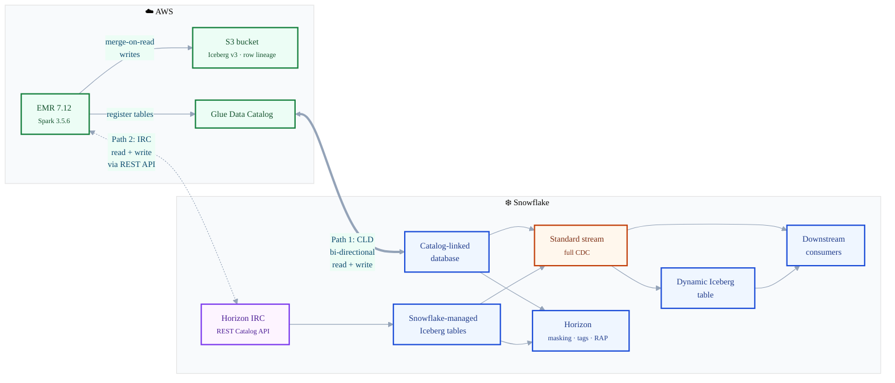
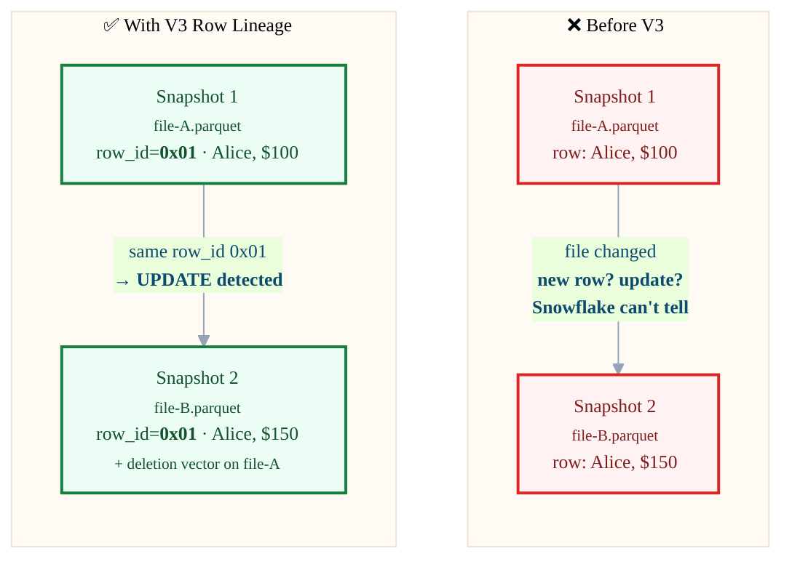
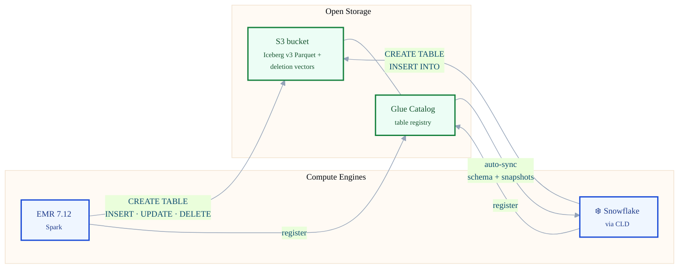

# The Battle for Compute: Iceberg V3 & Snowflake Interoperability

> Code companion for the [Medium article](https://medium.com/@your-handle/article-slug).  
> Tested: **March 25, 2026** | Snowflake V3 Support: **Public Preview**  
> EMR: **7.12** (Spark 3.5.6)

---

## Architecture



**Two interoperability paths, one governance layer:**

- **Path 1 — CLD:** EMR writes V3 Iceberg to S3 → Glue registers metadata → Snowflake CLD auto-syncs. Snowflake can also write back through CLD to the external catalog. *Your catalog, Snowflake's governance.*
- **Path 2 — Horizon IRC:** External engines (Spark, Trino, Flink) connect to Snowflake's Horizon Catalog via the Iceberg REST Catalog protocol and read/write directly to Snowflake-managed Iceberg tables. *Snowflake's catalog, open to every engine.*

Both paths feed into the same Horizon governance layer (masking, tagging, row access) and the same CDC pipeline (streams → DIT / MERGE).

---

## Repo Structure

```
├── README.md
├── scripts/
│   ├── create_v3_table.py          # Create V3 table with row lineage in EMR
│   ├── cdc_test_operations.py      # INSERT, UPDATE, DELETE, schema evolution
│   └── generate_scale_data.py      # 10M-row Glue 5.1 scale test for deletion vectors
└── sql/
    ├── 01_setup.sql                # External Volume, Catalog Integration, CLD
    ├── 02_streams_and_cdc.sql      # Standard stream + CDC queries
    ├── 03_deletion_vectors.sql     # Inspect .puffin deletion vector files
    ├── 04_governance.sql           # Masking, tagging, row access policies
    ├── 05_dynamic_iceberg_table.sql# DIT from CLD source
    ├── 06_merge_pattern.sql        # Consume stream via MERGE INTO
    └── 07_cld_writeback.sql         # Write back to external catalog from Snowflake
```

---

## Prerequisites

### AWS
- S3 bucket (e.g., `s3://your-iceberg-data/`)
- AWS Glue catalog
- EMR Serverless application (**EMR 7.12+** or **Glue 5.1+** required for V3 row lineage — Glue 5.0 does NOT support it)
- IAM execution role with S3 + Glue permissions

### Snowflake
- External Volume → S3
- Catalog Integration (REST-based for Glue)
- Catalog-Linked Database (CLD)

> Partnerships like Snowflake and Microsoft OneLake further extend this pattern — Snowflake-managed Iceberg tables can be stored natively in OneLake, and OneLake data can be accessed from Snowflake via similar catalog integration patterns. This repo focuses on the AWS Glue path, but the Iceberg V3 concepts (row lineage, deletion vectors, CDC) apply across cloud boundaries.

---

## Quick Start

### 1. Set up Snowflake infrastructure
```bash
# Run in Snowflake worksheet or SnowSQL
# Edit placeholders: <ACCOUNT_ID>, <REGION>, your_glue_database
```
→ [`sql/01_setup.sql`](sql/01_setup.sql)

### 2. Create a V3 table in EMR
```bash
aws s3 cp scripts/create_v3_table.py s3://your-iceberg-data/scripts/

aws emr-serverless start-job-run \
    --application-id <EMR_APP_ID> \
    --execution-role-arn arn:aws:iam::<ACCOUNT_ID>:role/EMR-Execution-Role \
    --job-driver '{
        "sparkSubmit": {
            "entryPoint": "s3://your-iceberg-data/scripts/create_v3_table.py",
            "sparkSubmitParameters": "--conf spark.jars.packages=org.apache.iceberg:iceberg-spark-runtime-3.5_2.12:1.7.1,software.amazon.awssdk:bundle:2.29.38"
        }
    }'
```
→ [`scripts/create_v3_table.py`](scripts/create_v3_table.py)

### 3. Verify row lineage
```bash
aws s3 cp s3://your-iceberg-data/glue_tables/.../metadata/00001-xxx.metadata.json - \
    | python3 -m json.tool | grep next-row-id
# Expected: "next-row-id": 3
```
> If `next-row-id` is null or missing, your engine does not support V3 row lineage.

### 4. Run DML operations (INSERT, UPDATE, DELETE)
→ [`scripts/cdc_test_operations.py`](scripts/cdc_test_operations.py)

### 5. Create a standard stream & query CDC
→ [`sql/02_streams_and_cdc.sql`](sql/02_streams_and_cdc.sql)

### Expected CDC output

| order_id | product_name | amount | METADATA$ACTION | METADATA$ISUPDATE | METADATA$ROW_ID |
|----------|-------------|--------|-----------------|-------------------|-----------------|
| 2 | Widget B | 250.00 | DELETE | true | 0000000000000001:1 |
| 2 | Widget B Pro | 299.99 | INSERT | true | 000000000000000F:15 |
| 5 | Widget E | 550.00 | INSERT | false | 0000000000000007:7 |
| 6 | Widget F | 650.00 | INSERT | false | 0000000000000008:8 |

- **INSERT** + `ISUPDATE = false` → new row  
- **DELETE + INSERT** + `ISUPDATE = true` → UPDATE (old deleted, new inserted)  
- **DELETE** + `ISUPDATE = false` → true delete  

---

## The Identity Model: Row Lineage

How Snowflake sees changes **before** and **after** V3 row lineage:



The `METADATA$ROW_ID` is a permanent serial number born with each row. When Snowflake sees the same `row_id` disappear from one file and reappear in another, it knows: **that's an UPDATE, not a new INSERT**.

### 6. Explore further
- [`sql/03_deletion_vectors.sql`](sql/03_deletion_vectors.sql) — inspect `.puffin` soft-delete files
- [`sql/04_governance.sql`](sql/04_governance.sql) — masking, tagging, row access on Iceberg
- [`sql/05_dynamic_iceberg_table.sql`](sql/05_dynamic_iceberg_table.sql) — automated pipeline
- [`sql/06_merge_pattern.sql`](sql/06_merge_pattern.sql) — consume CDC via MERGE
- [`sql/07_cld_writeback.sql`](sql/07_cld_writeback.sql) — write back to external catalog from Snowflake

---

## CLD Write-Back

CLD is **read and write by default**. You can create and populate tables in your external catalog directly from Snowflake:

```sql
USE DATABASE glue_iceberg_db;

CREATE ICEBERG TABLE "your_database"."orders_summary" (
    "region" VARCHAR,
    "total_orders" INT,
    "total_revenue" NUMBER(12,2)
)
ICEBERG_VERSION = 3;

INSERT INTO "your_database"."orders_summary"
SELECT "region", COUNT(*), SUM("amount")
FROM "your_database"."customer_orders_v3"
GROUP BY "region";
```

This writes Parquet to S3 and registers the table in Glue — EMR/Spark can immediately query it via `spark.sql("SELECT * FROM glue_catalog.your_database.orders_summary")`. True bidirectional interoperability.

### The Bridge Model: Bidirectional CLD



Both EMR and Snowflake are **first-class writers** to the same Iceberg tables. Glue is the shared catalog; S3 is the shared storage. CLD makes Snowflake a peer, not just a reader.

**Verified (March 25, 2026):** Table created as V3 (`ICEBERG_VERSION = 3`), registered in Glue (`catalog_table_name = orders_summary`), 4 Parquet files on S3, `can_write_metadata = Y`.

→ [`sql/07_cld_writeback.sql`](sql/07_cld_writeback.sql)

---

## Horizon IRC: The Other Direction

CLD is one direction. The complementary path is **Horizon IRC** (Iceberg REST Catalog): external engines write directly to **Snowflake-managed** Iceberg tables via Horizon's open APIs (powered by Apache Polaris). External reads are GA; writes are in Public Preview (March 2026).

The only question is: **who owns the catalog?**

| | CLD | Horizon IRC |
|---|---|---|
| **Catalog owner** | You (Glue, Unity, others) | Snowflake (Horizon) |
| **Snowflake's role** | Reader + writer to your catalog | Catalog provider via REST API |
| **External engine's role** | Reader + writer to their catalog (Snowflake writes back too) | Reader + writer to Snowflake tables |
| **Governance** | Masking, tags, RAP, lineage, data quality, sensitive data classification | Masking, tags, RAP, lineage, data quality, sensitive data classification, vending temporary + scoped storage credentials |
| **Status** | GA | Reads: GA / Writes: Public Preview |
| **Best for** | Existing lakehouse + add Snowflake | Snowflake-first + add Spark/Trino |
| **Table maintenance** | Your catalog or self-orchestrated | Snowflake |
| **HA/DR** | Self-built | Snowflake out-of-the-box |

Both paths share the same Horizon governance layer. Together, they deliver complete bidirectional interoperability — no other platform does both.

See [Ashwin Kamath's blog](https://www.snowflake.com/en/engineering-blog/bidirectional-interoperability-iceberg-snowflake-horizon-catalog/) for the full Horizon IRC walkthrough with Spark configuration.

---

## Deletion Vectors

V3 with `merge-on-read` uses `.puffin` deletion vector files instead of rewriting data files. Tested with 10M rows (Glue 5.1):

| Metric | DATA_FILE | DELETION_VECTOR |
|--------|-----------|----------------|
| File count | 37 | 1 |
| Total size | 75.8 MB | **493 bytes** |
| Avg file size | 2.0 MB | **493 bytes** |

The average data file is **4,358x larger** than the deletion vector. An UPDATE of 1,000 rows out of 10M produced a single 493-byte Puffin marker — instead of rewriting the ~2MB Parquet file containing those rows. At production scale (billion-row tables, GB-sized files), this is the difference between minutes and hours of CDC lag.

→ [`sql/03_deletion_vectors.sql`](sql/03_deletion_vectors.sql)

---

## Governance (Horizon)

All Snowflake governance features work on Iceberg tables — whether accessed via CLD or Horizon IRC:

| Feature | Works on CLD Iceberg? | Survives Schema Evolution? |
|---------|----------------------|---------------------------|
| Masking Policies | Yes | Yes |
| Object Tags | Yes | Yes |
| Row Access Policies | Yes | Yes |
| Sensitive Data Classification | Yes | Yes |

→ [`sql/04_governance.sql`](sql/04_governance.sql)

---

## Test Results (March 25, 2026)

| Test | Result |
|------|--------|
| Standard stream on externally managed V3 (via CLD) | **PASS** — mode: DEFAULT |
| INSERT captured | **PASS** |
| UPDATE captured as DELETE + INSERT pair | **PASS** — `ISUPDATE = true`, same ROW_ID |
| DELETE captured | **PASS** |
| `METADATA$ROW_ID` present | **PASS** |
| Deletion vectors (`.puffin`) present | **PASS** |
| Masking policy on Iceberg table | **PASS** — ACTIVE |
| Object tagging (Horizon) | **PASS** |
| Row access policy | **PASS** |
| CLD schema sync (ADD/DROP/RENAME) | **PASS** |
| CLD write-back (CREATE TABLE + INSERT from Snowflake to Glue) | **PASS** — V3, Glue-registered, 4 Parquet files on S3 |
| Dynamic Iceberg Table from CLD source | **PASS** |

### Engine Row Lineage Support

| Engine | Spark | Iceberg Lib | V3 Format | Row Lineage | Full CDC |
|--------|-------|-------------|-----------|-------------|----------|
| AWS Glue 5.0 | 3.5.4 | 1.7.1 | No | **No** | No |
| AWS Glue 5.1 | 3.5.6 | 1.10.0 | Yes | **Yes** | **Yes** |
| EMR 7.12 (Spark 3.5.6) | 3.5.6 | 1.7.1+ | Yes | **Yes** | **Yes** |
| Snowflake (managed) | — | — | Yes | **Yes** | **Yes** |

---

## Troubleshooting

### Glue 5.0 creates V3 but CDC still doesn't work

Glue 5.0 ships Spark 3.5.4 with Iceberg **1.7.1**, which predates V3 format support — it does **not** write row lineage metadata (`next-row-id` is null). Upgrade to **Glue 5.1** (Spark 3.5.6, Iceberg 1.10.0) or use **EMR 7.12+**. Check your metadata:

```bash
aws s3 cp s3://your-bucket/.../metadata/latest.metadata.json - | grep next-row-id
```

If it returns `null` or is missing — your engine doesn't support row lineage.

### Column names not found in Snowflake

Spark/Glue write lowercase column names. Snowflake preserves case for Iceberg tables. You must use double quotes:

```sql
-- Wrong
SELECT order_id FROM my_table;
-- ERROR: invalid identifier 'ORDER_ID'

-- Correct
SELECT "order_id" FROM my_table;
```

### Schema changes not syncing to CLD

CLD detects schema changes **only when a new snapshot arrives** (i.e., a data commit). Schema-only changes like `ALTER TABLE ADD COLUMN` without a subsequent INSERT/UPDATE won't trigger sync until the next DML operation creates a new snapshot.

### Stream shows mode INSERT_ONLY instead of DEFAULT

This means either:
- The table is V2, not V3
- The table is V3 but lacks row lineage (written by Glue 5.0, not Glue 5.1+ or EMR)
- V3 preview is not enabled on your account

Verify: `SHOW PARAMETERS LIKE 'ICEBERG_VERSION' IN TABLE <table_name>;`

### `Unable to parse the Iceberg metadata.json`

Your Snowflake account may not have V3 preview enabled, or the metadata was written by an engine that produces non-standard V3 metadata. Ensure:
1. EMR 7.12+ was used to create the table
2. The table has a valid `next-row-id` in metadata
3. Snowflake V3 Preview is active (it's PuPr — should be on for all accounts)

### Dynamic Iceberg Table fails with external catalog target

DIT output **must** be Snowflake-managed (`CATALOG = 'SNOWFLAKE'`). You cannot write a DIT to an externally managed target. The *source* can be external via CLD.

---

## Important Notes

1. **Iceberg V3 support is in Public Preview** as of March 2026
2. External engines **must** write proper row lineage: `_row_id = NULL` for new rows, maintain `_row_id` on copy-on-write
3. `MAX_DATA_EXTENSION_TIME_IN_DAYS` does not work on externally managed V3 tables
4. Dynamic Iceberg Table output must be Snowflake-managed
5. Column names from Glue/Spark are case-sensitive in Snowflake — use double quotes
6. Governance policies persist across CLD schema evolution

---

## Engine-Side CDC: Spark `create_changelog_view`

Snowflake streams are the Snowflake-native way to consume V3 CDC. For pure Spark pipelines, Iceberg provides a native equivalent:

```sql
CALL glue_catalog.system.create_changelog_view(
    table => 'your_database.customer_orders_v3',
    options => map('compute_updates', 'true')
);

SELECT * FROM customer_orders_v3_changes;
-- Returns: INSERT, DELETE, UPDATE_BEFORE, UPDATE_AFTER
```

---

## Further Reading

- [Iceberg V3 Specification Support in Snowflake](https://docs.snowflake.com/en/user-guide/tables-iceberg-v3-specification-support) — Official V3 docs
- [Stop Moving Data: Automate Your Open Lakehouse with Cortex Code CLI](https://www.snowflake.com/en/engineering-blog/catalog-linked-databases-cortex-code-cli-iceberg/) — Jeemin Sim on CLD + Cortex Code
- [Full Bidirectional Interoperability for Iceberg Tables in Horizon Catalog](https://www.snowflake.com/en/engineering-blog/bidirectional-interoperability-iceberg-snowflake-horizon-catalog/) — Ashwin Kamath on Horizon IRC writes (PuPr)

---

## License

MIT — use freely, attribution appreciated.
